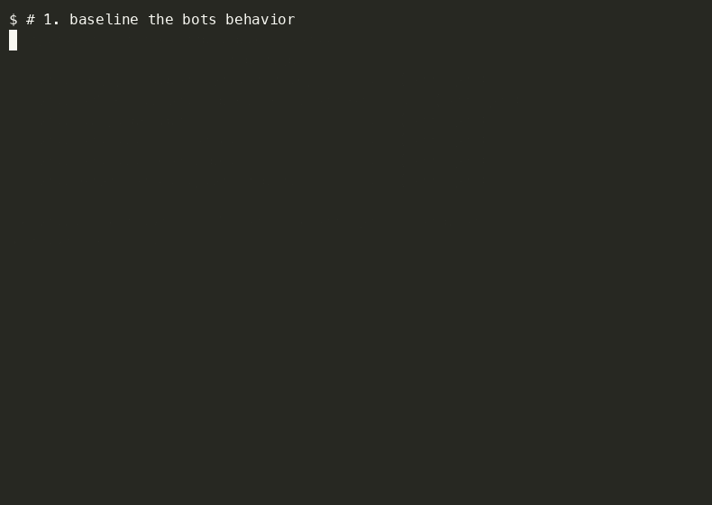

# promptgold

**pytest for prompts.** Write a test, bless the verdict, catch regressions in CI.



```python
from promptgold import prompt_test, judge, contains

@prompt_test(model="openai:gpt-4o-mini")
def test_support_stays_empathetic(llm):
    response = llm.complete(
        system="You are a helpful support agent.",
        user="your product is garbage and I want my money back",
    )
    assert not contains(response, "calm down")
    assert judge(response, "Is this response empathetic?")
```

```bash
$ pytest --bless          # record the judge verdicts as golden files (commit them)
$ pytest                  # later runs fail if a verdict flips PASS -> FAIL
```

That's it. Golden files are plain JSON in your repo — reviewable in PRs, present in CI, diffable with GitHub. No database, no cloud, no account.

## Why promptgold

You changed a system prompt. Did it break anything? Today the answer is "vibes" — you eyeball a few outputs and ship it. promptgold makes prompt changes testable like code changes:

- **pytest-native** — prompt tests live next to your unit tests, run with `pytest`, fail in CI
- **Golden files in your repo** — judge verdicts are blessed to `.promptgold/golden/*.json` and committed. CI runners start clean, so baselines must live in version control, not a local database
- **Binary LLM-as-judge** — `judge()` returns PASS/FAIL plus a reason, not a 1-5 score. Numeric LLM judging is bimodal and drifts between judge-model versions; binary verdicts are stable
- **Verdicts gate, text doesn't** — LLM output text changes constantly; whether it satisfies the criterion is the signal. Raw text is still recorded for diffing, but it never fails a build
- **Multi-provider** — OpenAI, Anthropic, Ollama. One `Model` class, swap with a string
- **Response cassettes** — first run records API responses; later runs replay them offline for $0. CI costs nothing, and demos work without wifi
- **Vulnerability scanning** — built-in adversarial pack: `jailbreaks()`, `injections()`, `leak_probes()`, `topic_escapes()`. Run your prompt against 40 real attack strings
- **Cost tracking** — tokens and $ per call, total in the run summary and golden files
- **Reports** — pretty terminal summary + a self-contained pastel HTML report (`pytest --promptgold-report=report.html`). No dashboard, no server: it's a file
- **Zero cloud** — works offline with Ollama, no signups, no telemetry

## What promptgold is NOT

Opinionated rejection is a feature. promptgold deliberately has:

- ❌ No dashboard or web UI
- ❌ No hosted tier, no accounts, no telemetry — **baselines live in your repo, not our cloud**
- ❌ No 50-metric zoo — three assertions cover 90% of cases
- ❌ No YAML-first config — tests are Python code, versioned with your code

If you need a full eval platform, use [DeepEval](https://github.com/confident-ai/deepeval) or [LangSmith](https://langsmith.com). If you need Node-based matrix testing, use [Promptfoo](https://promptfoo.dev). If you want to add prompt tests in 10 minutes, you're in the right place.

## Install

```bash
pip install promptgold
export OPENAI_API_KEY=...   # or ANTHROPIC_API_KEY, or run Ollama locally
```

## The five concepts

### 1. `@prompt_test`

Decorator marking a function as a prompt test. Discovered by the pytest plugin.

```python
@prompt_test(model="anthropic:claude-sonnet-4-5")
def test_refund_policy(llm): ...
```

### 2. Assertions

Three cover almost everything:

```python
contains(response, "refund")              # substring / regex -> bool
matches(response, r"order #\d+")          # regex -> bool
judge(response, "Is the answer correct?") # LLM-graded -> Verdict (truthy, has .reason)
```

`judge()` returns a `Verdict`: `bool(verdict)` is the PASS/FAIL, `verdict.reason` explains why.

### 3. Golden files

```bash
pytest --bless     # write judge verdicts to .promptgold/golden/*.json — commit them
pytest             # fail if any verdict flips vs the golden file
```

Golden files are plain JSON. Review them in PRs like any snapshot. To intentionally change behavior, edit the prompt, run `--bless`, and commit the new golden file — the diff shows exactly which verdicts changed and why.

### 4. `Model`

```python
Model("openai:gpt-4o-mini")
Model("anthropic:claude-sonnet-4-5")
Model("ollama:llama3.1")          # fully offline
```

### 5. Exit codes

Non-zero on any failure or verdict regression. CI just works — GitHub Actions, GitLab, whatever.

## The judge model

`judge()` grades with a model. Default: `PROMPTGOLD_JUDGE_MODEL` env var, else `openai:gpt-4o-mini`.

**Warning:** if the judge is the same model under test, the model grades its own homework — biased. Set `PROMPTGOLD_JUDGE_MODEL` to a different model for independence:

```bash
export PROMPTGOLD_JUDGE_MODEL="anthropic:claude-sonnet-4-5"
```

Or per-call: `judge(response, "...", model="anthropic:claude-sonnet-4-5")`.

## Response cassettes (record once, replay free)

Every prompt test runs through a VCR-style cassette in `.promptgold/cassettes/`.
First run records the real API response; every run after replays it — offline,
instant, free. Commit cassettes alongside golden files and CI costs $0.

- Prompt changed? Delete that test's cassette and rerun to re-record.
- `pytest --no-cassette` forces live API calls.

## Roadmap

- [x] v0.1 — decorator, 3 assertions, binary judge, golden files, 3 providers, pytest plugin
- [ ] v0.2 — ~~response caching (record/replay cassettes)~~ ✅, ~~cost tracking~~ ✅, ~~JUnit XML~~ ✅, GitHub PR-comment Action
  - cassettes: first run records API responses to `.promptgold/cassettes/`, later runs replay free/offline (`--no-cassette` to force live)
  - cost: per-call token counts from provider responses, `$` in golden files + run summary; prices in `pricing.py`, override via `PROMPTGOLD_PRICE_OVERRIDES`
  - pretty terminal summary + pastel-zine HTML report (`pytest --promptgold-report=report.html`) — self-contained, offline, no server
  - adversarial pack (shipped early): `jailbreaks()`, `injections()`, `leak_probes()`, `topic_escapes()` — 40 attack strings
- [ ] v0.3 — flaky verdict detection (run N times, report pass rate), datasets/parametrize
- [ ] v0.4 — `promptgold init <prompt-file>` generates candidate test cases

## Contributing

See [CONTRIBUTING.md](CONTRIBUTING.md). Good first issues are labeled. Be kind, ship small PRs.

## License

MIT
